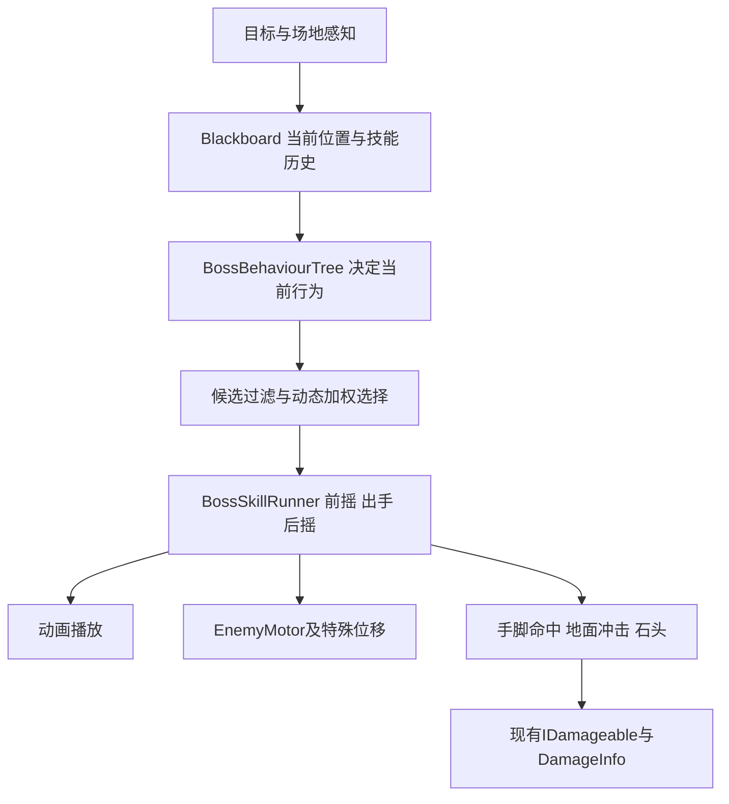

# Giant Golem Boss 行为树与技能编排方案

更新：2026-10-01。依据用户对动作玩法的确认和当前 Enemy/Player 代码。此文档替代此前 FSM 草案；本次只修改设计，Boss 运行时代码尚未实现。

## 1. 架构：复用 Enemy 能力，新增 Boss 决策层

普通敌人继续使用当前 FSM。Boss 新增行为树和统一技能执行器，不同时挂两个行为控制器，不把全部 Boss 规则塞进小怪的 EnemyStateMachine。



行为树回答“现在做什么”，执行器回答“这一招怎样完成”。前摇、出手、后摇是执行器内部的少量阶段，不需要再建立大型 Boss FSM。上图是职责划分，首版不必为每个框建立通用框架。

行为树最小节点：Condition、Sequence、Selector、Action，返回 Success / Failure / Running。加权选择是一个专用操作，不是默认 Selector 从上到下选择第一个可用技能。玩法方案不依赖外部插件；行为树运行时与可视化编辑器是不同实现范围，先确定行为语义再决定工具。

| 当前组件 | 复用决定及必要适配 |
|---|---|
| `EnemyMotor` | 保留 NavMesh 接近、Stop、FaceTarget、Teleport；冲刺/前进旋转加碰撞与边界检查，跳攻明确离地与交回 NavMesh 的时刻 |
| `EnemyTerritory` | 复用索敌、回位和边界概念；按 Boss 场地配置 |
| `EnemyHealth` | 保留生命值、IDamageable、HealthChanged/Died；当前直接调用 EnemyStateMachine.HandleDamageTaken，接入时改为伤害事件，让小怪与 Boss 各自处理硬直 |
| `EnemyAnimator` | 保留现有小怪入口；扩展按技能状态播放/读取时间，不能让 Boss 所有动作共用旧 Attack hash |
| `EnemyCombat` / `WeaponHitbox` | 复用伤害协议与命中去重；Boss 执行器按招式配置窗口、挂点、伤害和判定类型，不能沿用单一全局窗口 |
| `CheckpointManager` | 当前只枚举 EnemyStateMachine；接入统一重置契约，让小怪和 Boss 都能重置，Boss 不必挂小怪 FSM |
| `PlayerHealth` / `PlayerDodgeState` | 保留已有翻滚无敌帧和受伤流程；跳跃避地面冲击在命中筛选中处理 |

EnemyStateMachine 当前是 sealed 且固定小怪状态。推荐用组件组合增加 Boss，不直接继承它，也不复制完整 Enemy 系统。上述共享事件/重置契约在实际接入时做小范围调整，保持小怪行为。

## 2. 技能池：依据用户确认的玩法

| 技能类别 | 动画 | 决策位置和用途 | 执行方式 |
|---|---|---|---|
| 普通攻击 | `attack01–04_inplace` | 近距离前方，常用攻击 | 每次独立随机选一个，不连段；四招分别配置手/拳挂点和时序 |
| 冲刺 | `attack_DashAtk_inplace` | 中距离前方，通道可用 | 前摇末锁定方向，向前冲刺并在窗口内判伤 |
| 左右踩踏 | `attack_foot_left/right_inplace` | 玩家近距离在左/右侧 | 按 Boss 视角选脚，前摇后不换脚，落脚点触发大范围地面冲击 |
| 前进旋转 | `attack_whirlwind_inplace` | 近中距离追击/驱离贴身玩家，前方路线可用 | 快速向前移动并旋转，在窗口内对身周判伤 |
| 跳跃范围攻击 | `attack_jumpAtk_inplace` | 近中距离的范围压制，落点可用 | 先以 Boss 所在区域为落点，结合实际动画确认是否前跳；落地触发范围冲击 |
| 投石 | `attack_throwstone_inplace` | 玩家较远，投射路线可用 | 按释放帧生成石头，投向提前锁定的位置；遇障碍碎裂并 Destroy |
| 快跑接近 | `move_run_front_inplace` | 玩家较远，路径可达 | NavMesh 接近到攻击距离；属于位置调整，不算攻击技能 |

先选技能类别，再在普通攻击内部选四个动作之一。普通动作数量不会让其总概率放大四倍；左右踩踏也先选踩踏类别，再按位置确定脚侧。

`attack_ground01/02`、`defence01–03` 暂留候选库，不自动加入本次玩法。眩晕使用 Stun 三段，死亡使用 dead01/02；倒地起身作为备用，不默认实现第二套破防或二阶段。

## 3. 行为树结构

```text
Root：响应高优先级条件的 Selector
├─ 已死亡 → 中止行动，关闭伤害，播放死亡（终态）
├─ 重置 / 目标死亡或失效 / 离场 → 清理并回位或重置
├─ 破防中 → Stun_Start → 限时 Stun_Loop → Stun_End
├─ 已有行动运行中 → 继续技能或移动计划，不重新抽签
├─ 后摇/行动间隔未结束 → 恢复，暂不选招
├─ 无位置适用招式且需要调整朝向 → 短暂转向，不瞬转
├─ 决策点 → 感知快照 → 过滤候选 → 动态加权 → 提交行动
└─ 无可用攻击 → 安全接近/换位；路径失败则等待或回位
```

高优先级条件持续检查，选招只在行动结束、开始交战或中止后重新评估等决策点发生。行动返回 Running 时持续执行，不每帧重选。远处选择快跑后也保持计划，到达近战范围、超时或路径失败才结束，避免跑步/投石逐帧切换。

玩家处于侧面且踩踏可用时直接参与选招，不能先强制转正再做位置判断，否则会消除左右踩踏的使用条件。转向是没有适用招式时的位置调整，或选中某招后的有限准备阶段。

普通距离变化不打断已提交攻击。死亡、重置、目标失效中止行动；普通掉血不必打断，韧性耗尽才进入破防。某招是否允许被破防打断可配置，死亡始终生效。

Abort/结束统一关闭伤害窗口、恢复动画速度、释放位移控制权、清空未释放石头请求。Enter/Release/Complete 每次技能各执行一次，不能因行为树 Tick 重复播放动画或生成石头。

## 4. Blackboard 与位置判断

记录：目标和存活状态；Boss生命/韧性；平面距离、前向角、局部左右、地面高度；目标近期速度与近/远/侧/后方停留时间；路径/冲刺通道/落点/投射路线；CurrentSkill、LastSkill、LastFamily、最近3次技能；冷却、重复次数、决策时间；当前执行阶段和锁定方向/目标点。

不读取玩家输入缓冲或按键来瞬时反制。跳跃和翻滚状态参与命中规则，不在按键那一帧强制换 Boss 技能。感知可先按0.1–0.2秒间隔采样，死亡中止、技能时序和碰撞仍逐帧执行；这些间隔是初始建议，需测试调整。

距离阈值由模型尺寸、实际触及范围和场地确定。先定义近战有效范围 R，再区分近/中/远，边界留滞回，不能把小怪1.8米直接当 Boss 距离。

左右踩踏在提交技能时计算：

```text
offset = Player.position - Boss.position，忽略Y
side = Dot(Boss.right, offset)
side < -deadZone：左脚
side >  deadZone：右脚
中央死区：暂不选踩踏，使用其他合法招式
```

deadZone 按体型调节。左右以 Boss 视角为准，根节点方向与模型朝向一致；前进旋转由模型子节点表现，不能让用于感知的根方向跟着每帧旋转。后方近距离仍可按左右选脚，能否覆盖后方需检查实际伤害半径。

提交后锁定哪只脚，玩家绕到另一边也不瞬间换脚。落脚时以脚部挂点投射到地面作为伤害中心，形成该侧的大范围冲击，而非只检测脚模型直接接触。

## 5. 动态概率：先过滤，再调权重

这是一套本项目的历史/位置动态调权方案，不声称复现《只狼》的内部算法。

```text
Eligible(i) = 距离/角度适合 && 冷却完成 && 路线/落点可用 && 资源准备好
w(i) = BaseWeight(i)
       × DistanceFactor(i)
       × PositionFactor(i)
       × DwellFactor(i)
       × PreviousFamilyFactor(lastFamily, i)
       × RecentUseFactor(i)
P(i) = w(i) / 所有有效候选的权重之和
```

不合法招式权重为0；位置停留因子逐渐升高但封顶，不能累积成必出。总权重为0时转向、接近或等待，不对空池随机。所有转移偏好都受当前执行条件限制。

### 初始类别权重示例

以下是调参起点，不是最终平衡值。应用路线、角度、距离和冷却过滤后再归一化。

| 玩家位置 | 普通攻击 | 对应脚踩踏 | 冲刺 | 前进旋转 | 跳攻 | 快跑 | 投石 |
|---|---:|---:|---:|---:|---:|---:|---:|
| 近距离正前方 | 50 | 中央死区为0 | 0 | 20 | 30 | 0 | 0 |
| 近距离左/右/后侧 | 正面条件不足则0 | 55 | 0 | 20，路线需允许 | 25 | 0 | 0 |
| 中距离前方 | 未够到则0 | 0 | 45 | 35 | 20，落点需允许 | 没有合法攻击时回退 | 0 |
| 较远 | 0 | 0 | 距离不符则0 | 0 | 0 | 60 | 40 |

长期贴脚提高踩踏权重。长期绕背提高能覆盖该位置的踩踏/跳攻；旋转只有前进路线能形成威胁时才升权。长期远离适度提高投石，但路线受阻时仍要接近/换位。

### 上一招与近期历史

| 历史 | 初始规则 | 目的 |
|---|---|---|
| 上次相同技能类别 | 该类别 ×0.35 | 减少重复，仍保留自然随机 |
| 最近3次使用过该类别 | 每多一次再 ×0.7，设权重下限/上限约束 | 抑制重击或投石刷屏 |
| 上次投石 | 远距离快跑权重适当提升 | 改变压力方式 |
| 上次冲刺/旋转，现在已接近 | 普通攻击类别适当升权 | 形成位置变化后的自然动作选择 |
| 连续2次相同普通动作 | 若有其他合法动作，暂时排除该动作 | 四招有变化，不编成连段 |

左右脚共享类别和主要冷却，不能左踩/右踩绕过重复惩罚。四个普通动作内部先等权，给上一动作降权，并做连续重复保护；技能类别总权重固定，动作数量不影响类别总概率。

转移偏好仅调权重，不意味着“冲刺后必须接普通攻击”；仍需完成后摇、满足冷却，再进行下一次决策。

例：远处原始快跑60、投石40，上次投石使投石 ×0.35，得到约快跑81%、投石19%。若石头冷却未结束或线路不可用，投石直接退出候选池。例子仅展示上一招因子，近期历史可继续参与计算。

### CurrentSkill / LastSkill 的更新

CurrentSkill 是正在执行的已提交技能。LastSkill 是上一已提交并结束或中止的技能；LastCompletedSkill 可另记用于诊断。RecentSkills 记录已提交尝试，不记录每帧抽签。

抽签后再次检查条件，提交成功才设置 CurrentSkill。完成/中止时写入历史并清空当前技能；提交前失败不计入历史。被破防中止的技能也有短冷却，避免立刻重新刷同招。冷却起点必须统一明确为提交或释放，由配置控制，不能每帧重置。

快跑不是攻击技能，不覆盖 LastSkill；可单独记录 LastAction 调试跑步/投石选择。检查点重置清空技能历史、冷却和移动计划，恢复韧性。

## 6. 技能执行与移动权威

统一流程：提交 → 前摇有限追踪 → 锁方向/目标点 → 出手与伤害窗口 → 后摇 → 下一决策。动画已有收招时，不重复计算相同后摇；额外间隔只在需要时配置。

普通攻击/冲刺前摇早段慢速追踪，出手前锁方向。旋转锁前进路径，不能途中追着玩家急转。跳攻在起跳前锁落点，不在空中追踪玩家不断修改落点。投石在释放前的可读时刻锁瞄准点，飞出后不追踪。

每招分别标记方向锁定点、移动窗口、命中 normalizedTime、释放点和结束点，依据动画视觉确认；不沿用小怪的一套全局伤害窗口，也不凭名字猜命中时刻。

基础跑步由 EnemyMotor/NavMeshAgent 控制；冲刺/前进旋转检查碰撞与地面边界，遇墙减速或终止；跳攻离地由专门轨迹控制，落地验证合法点后交回 NavMesh。同一时刻只有一个执行者控制根位置。

优先原地动画加程序位移，便于沿用现有移动结构。Root Motion 可后续评估替代，不与程序位移叠加。视觉旋转与感知根方向分离，保持左右判断稳定。

## 7. 踩踏/跳攻的跳跃与翻滚规则

踩踏以落脚点为中心，跳攻以实际落地点为中心。首版做落地时的一次地面范围脉冲，配合一致的预兆和视觉效果；扩散冲击环可后续实现，视觉传播时刻与伤害时刻必须一致。

**在伤害范围内**，玩家脚底高于冲击高度的有效跳跃，或命中时处在翻滚无敌帧，可以避伤；玩家走出范围也应安全。不能用大球覆盖整个身体高度后无条件扣血，也不能因为玩家在 Jump 状态就豁免所有攻击。

现有 PlayerHealth.TakeDamage 拒绝 IsInvincible 伤害。PlayerDodgeState 在动画归一化时间0.2–0.65开启无敌（不含结束点），范围伤害仍走现有 TakeDamage；不能把整个 Dodge 状态都当无敌。

跳跃当前没有无敌。地面冲击筛选要结合脚底与当前位置地面的高度、冲击垂直范围和水平范围，可实现为低高度伤害区域或 GroundShockwave 命中规则。不能只判断 !IsGrounded，否则下台阶的短暂离地也会免伤；阈值要结合现有 JumpHeight 与脚底实际轨迹验证，跳晚或落早仍受伤。

第一版按用户目标只给踩踏/跳攻添加可跳过的地面冲击。如果以后另加脚底直接碾压/身体撞击，它们是独立伤害，需要明确规则，不能破坏玩家“跳跃躲冲击”的反馈。普通拳击、旋转和石头不自动获得跳跃免伤。

按目标而非 collider 去重。地面脉冲每个目标一次；旋转首版每个目标每次技能最多一次，以后需要多段伤害再配置命中间隔，不能每帧造成伤害。

## 8. 石头生命周期

路线过滤 → 投石前摇 → 锁定玩家位置/有限速度预测点 → 释放帧从手部挂点生成 → 按固定弹道飞行。石头不追踪目标。

抛物线检查实际轨迹可能经过的区域，直线 Linecast 只作粗过滤；高速飞行使用连续碰撞或路径 sweep，避免薄墙穿透。明确 Player/环境 mask，忽略 Boss 本体和无关触发器。

命中障碍物/地面：停止碰撞与运动，生成短暂碎裂效果，Destroy 石头。命中玩家：走现有伤害流程后碎裂并 Destroy；玩家无敌也按接触消耗石头，不能停在身上反复判伤。未命中按寿命/离场范围销毁，碎裂效果也有寿命。

死亡/检查点重置清理 Boss 所属石头和效果。普通破防取消尚未释放的石头，已飞出的石头默认继续；改变此规则需同步表现。首版 Instantiate/Destroy 足够，确有数量与性能需求再考虑对象池。

## 9. 调试与实施顺序

每次决策记录玩家距离/方位、候选排除原因、最终权重/概率、随机结果、选定技能、上一招；运行时显示执行阶段、是否锁方向、伤害窗口与冷却。固定种子选招测试帮助判断概率和过滤规则是否正确。

1. 共享接线：EnemyHealth 伤害事件、检查点重置契约，保留小怪行为；独立 Boss prefab 和行为树入口。
2. 最小行为树/执行器：跑步接近 + 四招独立随机，验证 Running/Abort、冷却和历史。
3. 左右踩踏/跳攻：验证方向锁定、地面冲击、跳跃高度、翻滚无敌帧和命中去重。
4. 冲刺/前进旋转：验证墙壁、NavMesh 边缘和位移控制权释放。
5. 投石：生成、轨迹、碰墙碎裂、玩家命中、寿命与重置清理。
6. 调整权重、后摇、预兆，再接破防和明确需要的扩展。可视化编辑器另行确定，不在玩法稳定前安装依赖或创建大框架。

验收覆盖：同场景小怪未回归、四招不是连段、左右正确且不在前摇换脚、概率与历史可解释、冷却优先于权重、远距跑步/投石不逐帧切换、旋转不穿墙、跳攻不在空中追踪、跳跃过早/过晚与翻滚无敌帧区别、范围外安全、石头碰墙仅碎裂一次、死亡/失去目标/检查点重置关闭伤害并清理所有行动。
