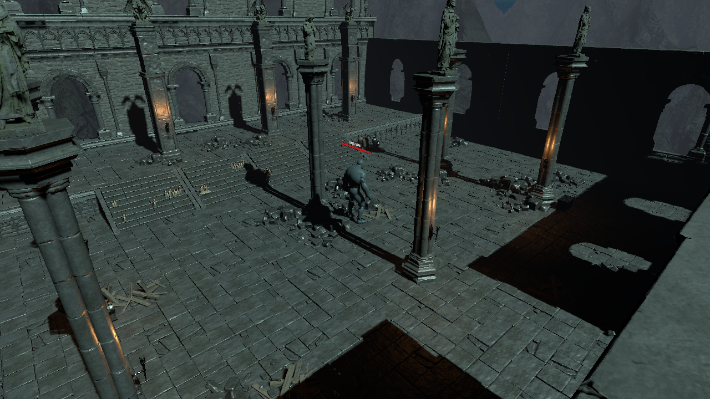

# Giant Golem 古代地牢接入

2026-10-02更正：当前测试主场景是 `03_AncientDungeon_Checkpoint`，Boss已接入该场景并保留新版HUD、赐福与消耗品接线，见 `GiantGolem_MainSceneIntegration.md`。以下保留此前05副本的接入记录；05来自较早的资源场景，其HUD接线不完整。

场景：`Assets/_Game/Scenes/05_AncientDungeon_GiantGolem.unity`。
基于当前 `Assets/Dark Fantasy Environment/Scenes/ANCIENT DUNGEON.unity` 保存副本，保留地牢、入口导航、玩家、两只原有小怪、相机和 HUD。

## 放置

- 请求坐标：`(-88.5, 39.5, -169)`。
- 实际 Boss 坐标：`(-89.75, 39.648, -167.75)`。原坐标紧邻柱子，按胶囊空间检查和烘焙后的导航点偏移约 1.8 米。
- 保留提供的四元数朝向，约 Y = -90 度；根节点 Scale = `(1, 1, 1)`，角色体型沿用现有 Boss 预制体。
- 场景实例：`GiantGolemBoss`，仍连接 `PF_GiantGolemBoss.prefab`。目标与奖励钱包绑定本场景玩家；检测距离 22 米、脱战范围 28 米。
- `GiantGolem_ApproachPoint` 在 `(-97.25, 39.680, -167.75)`，是已确认路径完整的近处测试点。玩家编辑态出生位置仍在原入口，需要近处试玩时可把玩家移动到这个点上方约 0.1 米。

## 导航

新增 `Navigation_GiantGolem` 和数据 `Assets/_Game/Navigation/NM_AncientDungeon_GiantGolem.asset`，覆盖目标坐标附近 `68 × 18 × 68` 米的局部区域。

使用环境层的物理碰撞体采集，采集源 203 个；本次烘焙半径 0.85 米、高度 4.4 米、最大跨阶 0.4 米、体素 0.12 米。继续使用现有 Agent Type 0，但只覆盖本次烘焙参数，未修改全局 Agent 配置。

调整区域环境后，使用 `Tools > SoulsLike RPG > Giant Golem > 8 Rebake Dungeon Boss Navigation` 重烘。这个菜单会保持导航数据 GUID 与 Boss 体型参数；Inspector 的普通 Bake 使用全局 Agent 默认体型。重烘后运行菜单 `7 Validate Dungeon Navigation` 复测。原入口导航数据保留；本次没有烘焙整张地牢或证明入口到 Boss 区域存在连续导航。

## 验证

- 出生点在导航上，环境胶囊检查通过；保存并重开新场景后，Boss 与导航数据有效。
- 区域内 294 个合格出生采样点，其中 284 个满足离 Boss 至少 3 米且路径完整的活动点。
- 真实 Play Mode 验证 Boss Agent 在导航上，向测试点实际寻路移动超过 1 米、路径完整；恢复出生点后 Agent 位置与控制权一致。
- 两只原有小怪仍在原导航网格上，运行验证没有导航回归。
- 原地牢预览相机上的两个 Missing Script 仅在新副本中移除；复测 Console 为 0 错误、0 警告。
- 原资源场景、原入口导航、`03_AncientDungeon_Checkpoint`、玩家预制体及 `ProjectSettings/NavMeshAreas.asset` 的 SHA256 均与接入前一致。

机器记录：`GiantGolem_DungeonPlacement.json`；运行记录：`Logs/GolemPlacement/RuntimeValidation.txt`；最终编辑器状态：`Logs/GolemPlacement/FinalEditorState.json`。

当前验证覆盖放置、保存和真实导航运动。此场地的连续战斗、镜头、石头碰柱与大范围技能手感仍需要人工试玩。

